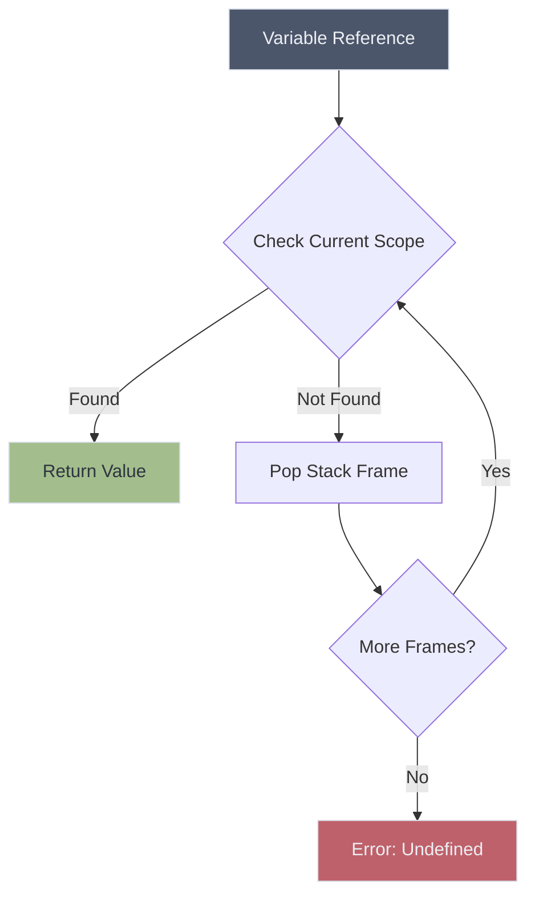
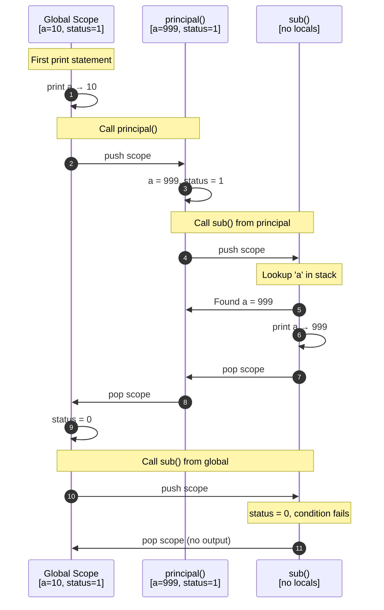

# Dynamic Scope Language Compiler

<div align="center">

**An educational interpreter demonstrating dynamic scoping through runtime call stack resolution**


[Overview](#overview) • [Scoping Explained](#dynamic-scoping-explained) • [Installation](#installation) • [Usage](#usage)

</div>

---

## Overview

This compiler implements dynamic scoping—a variable resolution mechanism where names are resolved based on the runtime call stack rather than lexical structure. Built with Flex, Bison, and C++, it serves as an educational tool for understanding alternative scoping strategies in programming language design.

**Core Technologies**

```
┌─────────────┬────────────────────────────────────────┐
│ Flex        │ Lexical analysis and tokenization      │
│ Bison       │ Syntax analysis and grammar parsing    │
│ C++         │ AST construction and execution engine  │
└─────────────┴────────────────────────────────────────┘
```

---

## Dynamic Scoping Explained

### The Fundamental Difference

In dynamic scoping, variable resolution follows the **call stack** at runtime, not the textual structure at compile time.



### Comparison Matrix

<table>
<thead>
<tr>
<th>Aspect</th>
<th>Dynamic Scoping</th>
<th>Lexical Scoping</th>
</tr>
</thead>
<tbody>
<tr>
<td>Resolution Time</td>
<td>Runtime</td>
<td>Compile Time</td>
</tr>
<tr>
<td>Search Strategy</td>
<td>Call stack traversal</td>
<td>Syntactic hierarchy</td>
</tr>
<tr>
<td>Visibility Rules</td>
<td>Caller's environment visible</td>
<td>Only defined scope visible</td>
</tr>
<tr>
<td>Predictability</td>
<td>Context-dependent</td>
<td>Context-independent</td>
</tr>
</tbody>
</table>

---

## Example Program

The following program demonstrates how variable resolution changes based on the execution context:

```javascript
a = 10;
status = 1;

func sub {
    if (status) {
        print a;
    }
}

func principal {
    a = 999;
    status = 1;
    sub();
}

print a;        
principal();    
status = 0;
sub();          
```

### Execution Trace



**Output**
```
10
999
```

The value printed by `sub()` depends entirely on **who called it**, not where it was defined.

---

## Project Structure

```
dynamic-scope-compiler/
│
├── include/
│   ├── ast.h                    # AST node definitions
│   └── environment.h            # Scope stack interface
│
├── src/
│   ├── lexer.l                  # Token specification
│   ├── parser.y                 # Grammar rules and AST construction
│   ├── ast.cpp                  # AST node implementations
│   └── environment.cpp          # Dynamic scope management
│
├── tests/
│   └── test.ds                  # Test programs
│
├── examples/                    # Additional demonstrations
│
├── Makefile                     # Build configuration
└── README.md
```

---

## Installation

### Prerequisites

Ensure you have the required build tools:

```bash
# Debian/Ubuntu
sudo apt-get install build-essential flex bison g++

# macOS (Homebrew)
brew install flex bison gcc make

# Fedora/RHEL
sudo dnf install gcc-c++ flex bison make
```

### Build Instructions

```bash
# Clone repository
git clone https://github.com/yourusername/dynamic-scope-compiler.git
cd dynamic-scope-compiler

# Compile
make

# Verify installation
./compiler --version
```

---

## Usage

### Running Programs

```bash
# Execute test file
./compiler < tests/test.ds

# Run custom program
./compiler < myprogram.ds

# Interactive mode (if supported)
./compiler
```

### Language Reference

**Variable Assignment**
```javascript
x = 42;
flag = true;
```

**Function Definition**
```javascript
func functionName {
    // Function body
}
```

**Conditional Execution**
```javascript
if (condition) {
    // Executed if condition is truthy
}
```

**Function Invocation**
```javascript
functionName();
```

**Output Statement**
```javascript
print expression;
```

---

## Implementation Architecture


### Component Responsibilities

<table>
<thead>
<tr>
<th width="20%">Component</th>
<th width="20%">Files</th>
<th>Purpose</th>
</tr>
</thead>
<tbody>
<tr>
<td>Lexical Analyzer</td>
<td><code>lexer.l</code></td>
<td>Converts character stream into tokens (identifiers, keywords, operators)</td>
</tr>
<tr>
<td>Syntax Analyzer</td>
<td><code>parser.y</code></td>
<td>Validates grammar and constructs abstract syntax tree</td>
</tr>
<tr>
<td>AST</td>
<td><code>ast.h/cpp</code></td>
<td>Tree structure representing program semantics and evaluation logic</td>
</tr>
<tr>
<td>Environment</td>
<td><code>environment.h/cpp</code></td>
<td>Manages scope stack for dynamic variable resolution</td>
</tr>
</tbody>
</table>

### Scope Stack Mechanism

The environment maintains a stack of hash maps. On variable lookup:

1. Search the topmost (current) scope
2. If not found, move to the previous stack frame
3. Repeat until found or stack exhausted
4. Throw error if undefined

This contrasts with lexical scoping, where the search follows the syntactic nesting of code blocks.

---

## Academic Context

This project addresses key concepts in compiler theory:

<table>
<tbody>
<tr><td>Lexical Analysis</td><td>Regular expressions and finite automata</td></tr>
<tr><td>Syntax Analysis</td><td>Context-free grammars and parse trees</td></tr>
<tr><td>Semantic Analysis</td><td>Scope resolution and type systems</td></tr>
<tr><td>Runtime Systems</td><td>Call stacks and environment management</td></tr>
<tr><td>Language Design</td><td>Scoping strategies and their implications</td></tr>
</tbody>
</table>

---

## License

```
MIT License

Copyright (c) 2024 Pedro V. Santos

Permission is hereby granted, free of charge, to any person obtaining a copy
of this software and associated documentation files (the "Software"), to deal
in the Software without restriction, including without limitation the rights
to use, copy, modify, merge, publish, distribute, sublicense, and/or sell
copies of the Software, and to permit persons to whom the Software is
furnished to do so, subject to the following conditions:

The above copyright notice and this permission notice shall be included in all
copies or substantial portions of the Software.

THE SOFTWARE IS PROVIDED "AS IS", WITHOUT WARRANTY OF ANY KIND, EXPRESS OR
IMPLIED, INCLUDING BUT NOT LIMITED TO THE WARRANTIES OF MERCHANTABILITY,
FITNESS FOR A PARTICULAR PURPOSE AND NONINFRINGEMENT. IN NO EVENT SHALL THE
AUTHORS OR COPYRIGHT HOLDERS BE LIABLE FOR ANY CLAIM, DAMAGES OR OTHER
LIABILITY, WHETHER IN AN ACTION OF CONTRACT, TORT OR OTHERWISE, ARISING FROM,
OUT OF OR IN CONNECTION WITH THE SOFTWARE OR THE USE OR OTHER DEALINGS IN THE
SOFTWARE.
```

---

<div align="center">

**Pedro V. Santos**  
Computer Science Student
*Developed for academic purposes in compiler construction*

</div>
